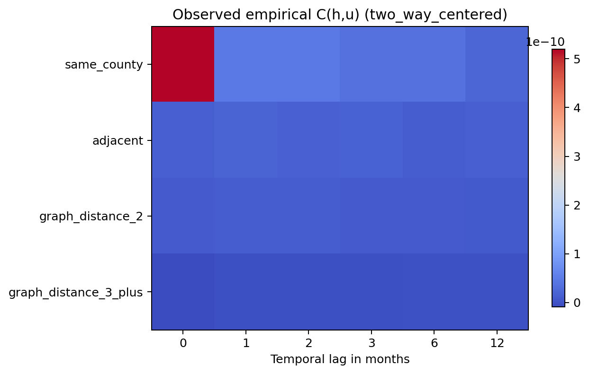
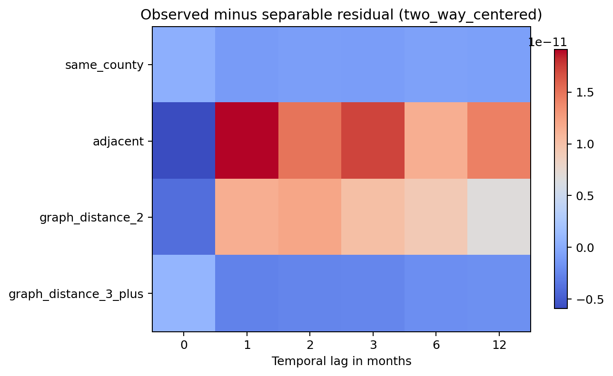
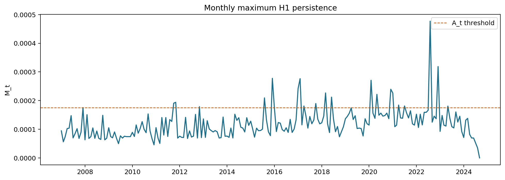
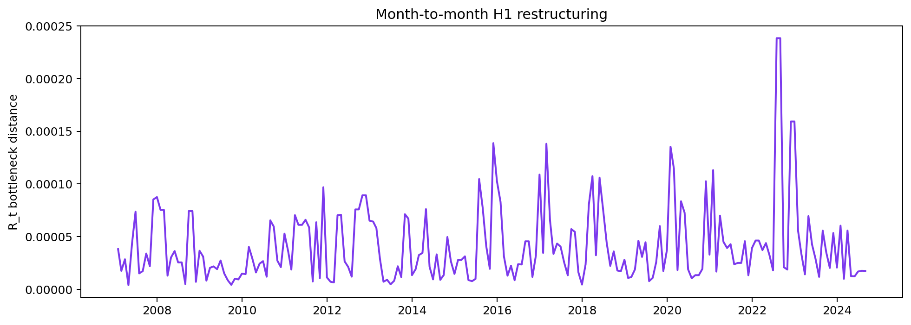

## Introduction

We previously carried out uniformity testing and rejected the null hypothesis that the Ohio overdose data are spatially uniformly distributed. We then rejected the null hypothesis of no spatial autocorrelation and concluded that overdose deaths in nearby counties are statistically related. Those analyses worked both globally, aggregating all months together, and in each month separately, but they did not study how overdose deaths change jointly in space and time. We view the overdose data as a scalar field, assigning a number of deaths (or deaths per capita) to each (county,month) pair.

Separately, many papers have shown that there is temporal autocorrelation in overdose deaths. For example, the number of overdose deaths last month is statistically significantly related to the number this month; see the discussion of Ohio overdose time series in [9]. A dataset can have spatial autocorrelation and temporal autocorrelation without having spatiotemporal spread. That would happen if the same counties were consistently high, and the statewide monthly totals rose and fell over time, but the spatial pattern did not move through Ohio in a coordinated way.

This notebook carries out null hypothesis tests for spatiotemporal spread of overdose deaths. As in the uniformity notebook, we use two approaches. The first is a classical covariance test. The second is a TDA test built from the path of monthly $H_1$ persistence diagrams and vineyard-style summaries. The TDA analysis includes permutation tests that disrupt geography or chronology, and a separable Gaussian TDA/vineyard test that simulates new county-month scalar fields from a model with separable space-time covariance. Both the classical and TDA approaches reject the relevant null hypothesis, so we conclude that vineyards are an appropriate exploratory tool for studying and visualizing spatiotemporal spread. In separate analyses, we create GIF files showing how overdose deaths move from county to county, and we use vineyards to forecast where the signal is going next. Even though the GIF files show convincingly that things are changing in time and space, we find it valuable to have a test that can tell whether the change is statistically significant. In addition, this test can be carried out on different data sets, such as the residuals of a model. Any good model should leave random and independent residuals, where the test in this notebook would fail to reject the null hypothesis.

The classical test asks whether the empirical space-time covariance can be approximated by a product of a spatial covariance component and a temporal covariance component. This is the classical separability idea: space contributes one factor, time contributes another factor, and the joint covariance contains no additional space-time interaction.

The TDA test asks whether the observed path of monthly $H_1$ persistence diagrams and vine summaries can be explained by null hypothesis models that remove joint spatiotemporal organization. The strongest connection to covariance separability comes from the separable Gaussian TDA/vineyard test: it estimates separate spatial and temporal covariance matrices, simulates new county-month scalar fields from their product covariance, computes the same monthly $H_1$ diagrams and vine summaries, and compares the observed summaries with the simulated distribution. To our knowledge, this is the first TDA-based hypothesis test for spatiotemporal autocorrelation. We are unaware of previous work proposing a null hypothesis model that preserves spatial and temporal structure separately while destroying their joint spatiotemporal topological organization. The null hypothesis model introduced here is motivated by the classical notion of covariance separability, but it is formulated in terms of persistent homology and vineyards.

The analysis uses deaths per capita for 88 Ohio counties over 213 months, from January 2007 through September 2024. The classical and primary TDA permutation computations were run with 200 simulation replicates for each null hypothesis model. The separable Gaussian TDA/vineyard computation was run with 50 replicates because each replicate recomputes monthly $H_1$ diagrams and exact vine summaries. We report ordinary empirical p-values: a reported value of $0$ means that none of the simulated null hypothesis worlds was at least as extreme as the observed data at this simulation resolution. It does not mean that the exact tail probability is literally zero.

## Roadmap

This notebook does the following steps.

1. Review related work on separability, spatiotemporal modeling, and TDA null hypothesis tests.
2. State the null hypotheses and discuss classical and TDA-based test statistics.
3. Show the Python code that prepares the county-month data, computes the covariance and TDA statistics, simulates null hypothesis datasets, and writes the saved output files used later in the notebook.
4. Load the saved output files and display the covariance separability tests.
5. Interpret the observed, fitted separable, and residual covariance heatmaps.
6. Display the observed monthly $H_1$ summaries and the TDA permutation tests for geography and chronology.
7. Display the separable Gaussian TDA/vineyard test, which compares observed diagram and vine summaries with simulations from product space-time covariance.
8. Compare the classical and TDA tests.

## Related Work

Classical tests of separability for space-time covariance include the likelihood-ratio framework of Mitchell, Genton, and Gumpertz [6] and the covariance-property tests of Li, Genton, and Sherman [5]. These methods are easiest to apply when the data include several independent copies of the same spatiotemporal process, e.g., a collection of $n$ point clouds. Here we have only one point cloud, so we use randomization-based inference (i.e., simulated data sets generated from our data, under the assumption of the null hypothesis).

Lan [4] studies the temporal evolution of spatial dependence in generalized spatiotemporal Gaussian-process models. Sousa and Small [8] use dimensionality reduction to characterize spatiotemporal data manifolds, which is another way to look for joint space-time structure without reducing the problem to separate spatial and temporal summaries.

Several TDA papers are closer to the topological part of this notebook. Cipriani, Hirsch, and Vittorietti [1] develop topology-based goodness-of-fit tests for sliced spatial data. Sitoleux, Carboni, Lbath, and Achard [7] use persistent homology to compare potential generating models for fMRI data, including one spatiotemporal model. Glenn, Cisewski-Kehe, Zhu, and Bement [2] propose a hypothesis-testing framework for topological features in spatiotemporal image stacks, with a null hypothesis that there are no true topological features in the underlying image sequence. Hickok, Needell, and Porter [3] use persistent homology and vineyards to study spatial and spatiotemporal anomalies in COVID-19 data; their method tracks anomalies through time, but it does not formulate or test any null hypothesis.

These papers show that TDA is already being used for spatiotemporal data, vineyards, and null models. The contribution of the null hypothesis test presented here is to determine whether a given dataset can be explained by a model that retains spatial and temporal information separately while disrupting their joint spatiotemporal topological arrangement. Rejecting this null hypothesis tells you that something spatiotemporal is going on, involving the interplay of time and space. We view this as a valuable first check before carrying out a vineyard analysis. Heuristically, if spatial structure and temporal structure were independent, then the most persistent topological features might change over time without showing the same coordinated vine behavior as the observed data. The separable Gaussian TDA/vineyard simulation below turns that intuition into a test: it asks whether data generated from a product of spatial and temporal covariance matrices produce vine persistence and restructuring comparable to the observed Ohio data.

## Statement of Null Hypotheses

### Null Hypothesis 1: Separable Spatiotemporal Covariance

Let $Y_{c,t}$ denote the deaths-per-capita value in county $c$ and month $t$. Our first null hypothesis tests whether the covariance between two county-month values can be explained by separate spatial and temporal components, as it would be if the spatial part was independent from the temporal part:

$$
Cov(Y_{c,t}, Y_{c',t'}) = C_{space}(c,c') C_{time}(t,t').
$$

Here $C_{space}(c,c')$ is a spatial covariance term depending only on the two counties, and $C_{time}(t,t')$ is a temporal covariance term depending only on the two months. If the null hypothesis were correct, the covariance between $(c,t)$ and $(c',t')$ would factor into one term depending only on the relationship between counties and another term depending only on the relationship between months. The space-time covariance matrix would then look approximately like a rank-one product surface.

We normally measure temporal dependence via the correlation of a time series $x_t$ with its lagged versions like $x_{t-1}, x_{t-12}$, etc. If there was no temporal autocorrelation, then knowledge of the past is useless for predicting the future. Similarly, we measure spatial dependence via the correlation with spatial lags, e.g., death counts in neighboring counties. If there is no spatial autocorrelation, then it would not be possible to predict the value in a county based on the values in neighboring counties.

To test separability, we build a lag-covariance statistic. The code groups county pairs by graph distance and month pairs by time lag. The spatial bins are: the same county, adjacent counties, graph distance 2, and graph distance 3 or more. The temporal lags are 0, 1, 2, 3, 6, and 12 months. For each spatial-distance bin $h$ and temporal lag $u$, it computes an empirical covariance $C_{emp}(h,u)$ and fits the best product approximation $C_{sep}(h,u)=\widehat a_h\widehat b_u$. The matrices $C_{emp}$ and $C_{sep}$ collect these values over all displayed spatial bins and temporal lags. The test statistic is the relative squared residual:

$$
T_{sep,rel} =
\frac{\| C_{emp} - C_{sep} \|_F^2}{\| C_{emp} \|_F^2}.
$$

Large values indicate that the empirical lag-covariance matrix is not well explained by a separable product of spatial and temporal lag effects. We use randomization-based calibration to turn this statistic into a p-value.

The classical test uses two calibration models.

1. **Global time-block permutation.** Contiguous blocks of months are permuted globally, using the same block order for every county. This preserves each monthly spatial field and local temporal dependence inside blocks, but it changes the global chronology. For example, if the months were divided into 12-month blocks, one simulated replicate might place October 2023 through September 2024 first, then January 2012 through December 2012, then the remaining blocks in a new random order. Every county receives the same reordered block sequence.
2. **Separable Gaussian matrix-normal simulation.** Spatial and temporal covariance matrices are estimated and regularized, then matrix-normal county-month datasets are simulated under the separable model. This is the closest model-based version of the separability null hypothesis used here. In each replicate, the simulated data have one estimated spatial covariance matrix and one estimated temporal covariance matrix, but no additional joint space-time interaction term.

### Null Hypothesis 2: TDA Permutation Tests for Geography and Chronology

In this section, we introduce TDA permutation tests that study the same broad issue from a different lens. The covariance test looks for second-order space-time interaction. The TDA permutation tests ask whether the observed sequence of monthly $H_1$ diagrams is unusual under specific randomizations that remove one kind of joint spatiotemporal organization while preserving lower-dimensional features of the data.

For each month $t$, let $D_t^{(1)}$ be the $H_1$ persistence diagram computed from the county deaths-per-capita scalar field on the Ohio polygonal surface. We summarize the sequence $D_1^{(1)},\ldots,D_T^{(1)}$ using three test statistics:

1. $M_t$, the maximum $H_1$ persistence in month $t$.
2. $R_t=d_B(D_{t-1}^{(1)},D_t^{(1)})$, the bottleneck distance from the previous month's $H_1$ diagram to the current month's $H_1$ diagram.
3. The bottleneck path length, $\sum_{t=2}^T R_t$, which summarizes total month-to-month topological restructuring.

The phrase "joint topological organization" means information in the ordered geographic sequence of $H_1$ diagrams that is not explained by the monthly distributions alone or by the same monthly maps placed in an arbitrary block order. We test this using two permutation null hypothesis models.

1. **Within-month spatial permutation.** The null hypothesis is that, conditional on the multiset of county rates observed in each month, the assignment of those rates to Ohio counties is exchangeable. For each month, county values are permuted over the Ohio surface. This preserves each month's marginal distribution but destroys geography. Rejection means that the observed topological summaries depend on where the county rates occur, not only on the list of rates present in each month.
2. **Global time-block permutation.** The null hypothesis is that, conditional on the observed monthly maps and local order inside short blocks, the global order of those blocks is exchangeable. The complete monthly spatial fields are permuted in contiguous blocks. This preserves spatial organization within months and local temporal order inside blocks, but it changes the global chronology. For example, if 12-month blocks are used, the simulated chronology might begin with October 2023 through September 2024, then jump to January 2010 through December 2010, while preserving the county map inside every month.

The global time-block permutation should be read as a chronology test conditional on the observed monthly maps. It asks whether the temporal structure is special, or if what we see is consistent with randomly permuted time blocks. If the null hypothesis model were adequate, then cutting the observed history into short contiguous blocks and reordering those blocks would produce topological restructuring statistics comparable to the observed chronology. Rejection means that the actual ordering of months carries information not explained by the collection of monthly spatial fields alone.

A third TDA test below returns directly to the separability null hypothesis from Section 3.1. In the separable Gaussian TDA/vineyard test, the null hypothesis is that the data are generated from a model with product space-time covariance. The code estimates one spatial covariance matrix and one temporal covariance matrix, simulates new county-month scalar fields from their product covariance, and compares the observed $H_1$ diagram and vine summaries with the simulated distribution.

We report two-sided empirical p-values for the TDA tests. This is the clearest choice here because the observed statistic can be unusual in either direction, compared to the null hypothesis model. For example, a random spatial rearrangement might produce less coherent persistence than the observed data, while a random block chronology might produce more abrupt month-to-month restructuring than the actual chronology.

Because the displayed TDA permutation table reports five two-sided comparisons, there is a small multiple-testing problem as discussed in the uniformity notebook. As we did there, we also report Benjamini-Hochberg adjusted q-values. The adjustment is applied within the displayed TDA family, so the q-value should be read as a multiple-testing-aware version of the two-sided p-value.

## Setup

### Simulation Code

This notebook is self-contained: the code below is the code used to create the files in the folder `spatiotemporal_autocorrelation_outputs` that are read later in the notebook. These code chunks are marked `eval: false` so that rendering the notebook reads the saved CSV and PNG files instead of recomputing all the simulation replicates. To recompute the analysis from scratch, run these source chunks in order and then rerun the executed summary chunks that follow.

The first non-executed code cell contains the imports, configuration, random seed, path setup, and package checks used for the classical covariance and TDA simulation analyses in this notebook. It also creates the output directory `spatiotemporal_autocorrelation_outputs`, where the CSV and PNG files used later in this notebook are written.

```{python}
#| label: analysis-imports-source
#| eval: false
from __future__ import annotations

import contextlib
import io
import json
import math
import os
import sys
import warnings
from dataclasses import dataclass
from pathlib import Path
from typing import Iterable

os.environ.setdefault("MPLCONFIGDIR", "/tmp/matplotlib-cache")

import numpy as np
import pandas as pd
import matplotlib.pyplot as plt

try:
    import scipy.sparse.csgraph as csgraph
except Exception as exc:
    csgraph = None
    warnings.warn(f"scipy is unavailable; graph-distance bins will use a slower fallback. {exc}")

try:
    import gudhi as gd
except Exception as exc:
    gd = None
    warnings.warn(f"gudhi is unavailable; exact H1/bottleneck/vineyard cells will be skipped. {exc}")

WORKING_DIR = Path.cwd()
if WORKING_DIR.name == "spatiotemporal files":
    SPATIOTEMPORAL_DIR = WORKING_DIR
    PROJECT_ROOT = WORKING_DIR.parent
else:
    PROJECT_ROOT = WORKING_DIR
    SPATIOTEMPORAL_DIR = WORKING_DIR / "spatiotemporal files"

if not (PROJECT_ROOT / "data" / "county_drug_death.csv").exists():
    raise FileNotFoundError(
        f"Could not locate county_drug_death.csv in the data directory under {PROJECT_ROOT}."
    )
VINEYARD_PACKAGE_DIR = PROJECT_ROOT
if str(VINEYARD_PACKAGE_DIR) not in sys.path:
    sys.path.insert(0, str(VINEYARD_PACKAGE_DIR))

try:
    from polygonal_surface import PolygonalSurface as PS
except Exception as exc:
    PS = None
    warnings.warn(f"Could not import the existing vineyard PolygonalSurface code. {exc}")

CONFIG = {
    "seed": 20260606,
    "rate_scale": 100_000.0,
    "primary_preprocessing_modes": ["raw_rate", "county_centered", "month_centered", "two_way_centered"],
    "primary_mode_for_tda": "raw_rate",
    "classical_B": 200,      # use 999 for the final manuscript run
    "tda_B": 200,            # TDA is much more expensive than the covariance diagnostic
    "event_bootstrap_B": 200,
    "temporal_lags": [0, 1, 2, 3, 6, 12],
    "time_block_length": 6,
    "h1_significance_threshold_quantile": 0.90,
    "make_exact_vineyard_summary": True,
    "max_exact_vines_to_save": 25,
    "output_dir": SPATIOTEMPORAL_DIR / "spatiotemporal_autocorrelation_outputs",
}

COUNTY_NAME_ALIASES = {
    "Van Wert": "VanWert",
}

def stable_seed(label: str, base: int | None = None) -> int:
    """Create a reproducible integer seed from a text label.

    Args:
        label: Label identifying the simulation component.
        base: Optional base seed. If omitted, CONFIG["seed"] is used.

    Returns:
        Integer seed suitable for NumPy random generators.
    """
    base = CONFIG["seed"] if base is None else int(base)
    total = sum((i + 1) * ord(ch) for i, ch in enumerate(str(label)))
    return int((base + total) % (2**32 - 1))

CONFIG["output_dir"].mkdir(exist_ok=True)
rng = np.random.default_rng(CONFIG["seed"])
print(f"Spatiotemporal folder: {SPATIOTEMPORAL_DIR}")
print(f"Output directory: {CONFIG['output_dir']}")
print(f"gudhi available: {gd is not None}; vineyard surface code available: {PS is not None}")
```

The next non-executed code cell prepares the Ohio county-month data. It reads the county death counts, deaths-per-capita data, population metadata, and county adjacency file; harmonizes county names; constructs the county-by-month matrices and long county-month data; computes graph distances between counties; and writes the prepared data files that the executed cells load later.

```{python}
#| label: analysis-data-preparation-source
#| eval: false
@dataclass
class PreparedPanel:
    long: pd.DataFrame
    rates: pd.DataFrame
    counts: pd.DataFrame
    populations: pd.DataFrame
    county_names: list[str]
    month_labels: list[str]
    dates: pd.DatetimeIndex
    W: np.ndarray
    graph_distances: np.ndarray
    adjacency_edges: pd.DataFrame
    ps: object | None = None


def _read_wide_county_month_csv(path: Path) -> pd.DataFrame:
    """Read a wide county-by-month CSV file.

    Args:
        path: Path to a CSV whose first column contains county names.

    Returns:
        Data frame indexed by county with month columns sorted chronologically.
    """
    df = pd.read_csv(path)
    first = df.columns[0]
    df = df.rename(columns={first: "county"}).set_index("county")
    df.index = df.index.astype(str).str.strip()
    df = df.rename(index=COUNTY_NAME_ALIASES)
    month_cols = [c for c in df.columns if "_" in str(c)]
    df = df[month_cols].apply(pd.to_numeric, errors="coerce").fillna(0.0)
    order = sorted(df.columns, key=lambda x: tuple(map(int, str(x).split("_"))))
    return df[order]


def _month_label_to_year_month(label: str) -> tuple[int, int]:
    """Split a month label of the form YYYY_M into year and month.

    Args:
        label: Month label used in the overdose CSV files.

    Returns:
        Tuple containing the integer year and month.
    """
    y, m = str(label).split("_")
    return int(y), int(m)


def _read_populations(path: Path, counties: list[str], month_labels: list[str]) -> pd.DataFrame:
    """Read county population values aligned to county-month labels.

    Args:
        path: Path to the population CSV.
        counties: Counties to retain.
        month_labels: Month labels to align with population years.

    Returns:
        Long data frame with one row per county-month population value.
    """
    pop = pd.read_csv(path).rename(columns={"Unnamed: 0": "county"}).set_index("county")
    pop.index = pop.index.astype(str).str.strip()
    pop = pop.rename(index=COUNTY_NAME_ALIASES)
    pop = pop.apply(pd.to_numeric, errors="coerce")
    years_available = sorted(int(c) for c in pop.columns if str(c).isdigit())
    rows = []
    for county in counties:
        for label in month_labels:
            year, month = _month_label_to_year_month(label)
            use_year = year if str(year) in pop.columns else max(y for y in years_available if y <= year)
            rows.append({
                "county": county,
                "month_label": label,
                "year": year,
                "month": month,
                "population_year_used": use_year,
                "population": float(pop.loc[county, str(use_year)]) if county in pop.index else np.nan,
            })
    return pd.DataFrame(rows)


def _parse_adjacency_txt(path: Path, counties: list[str]) -> tuple[np.ndarray, pd.DataFrame]:
    """Parse the Ohio county adjacency text file.

    Args:
        path: Path to the adjacency text file.
        counties: County names used to order the adjacency matrix.

    Returns:
        Tuple containing the adjacency matrix and an edge-list data frame.
    """
    index = {c: i for i, c in enumerate(counties)}
    W = np.zeros((len(counties), len(counties)), dtype=int)
    rows = []
    for line in path.read_text().splitlines():
        parts = [p.strip() for p in line.split("\t") if p.strip()]
        if not parts:
            continue
        county = parts[0]
        if county not in index:
            continue
        for nbr in parts[1:]:
            if nbr == "exterior" or nbr not in index:
                continue
            i, j = index[county], index[nbr]
            W[i, j] = W[j, i] = 1
            rows.append({"county": county, "neighbor": nbr})
    edges = pd.DataFrame(rows).drop_duplicates() if rows else pd.DataFrame(columns=["county", "neighbor"])
    return W, edges


def _graph_distance_matrix(W: np.ndarray) -> np.ndarray:
    """Compute graph distances between counties.

    Args:
        W: Binary county adjacency matrix.

    Returns:
        Matrix of shortest-path graph distances.
    """
    if csgraph is not None:
        return csgraph.shortest_path(W, directed=False, unweighted=True)
    n = W.shape[0]
    D = np.full((n, n), np.inf)
    for start in range(n):
        D[start, start] = 0
        frontier = [start]
        while frontier:
            current = frontier.pop(0)
            for nbr in np.flatnonzero(W[current]):
                if not np.isfinite(D[start, nbr]):
                    D[start, nbr] = D[start, current] + 1
                    frontier.append(nbr)
    return D


def load_ohio_spatiotemporal_panel() -> PreparedPanel:
    """Load and align Ohio overdose, population, and adjacency data.

    Returns:
        PreparedPanel containing long data, matrices, graph distances, and the polygonal surface.
    """
    counts = _read_wide_county_month_csv(SPATIOTEMPORAL_DIR.parent / "data" / "county_drug_death.csv")
    rates = _read_wide_county_month_csv(SPATIOTEMPORAL_DIR.parent / "data" / "pop_normalized_county_drug_death.csv")
    common_counties = sorted(set(counts.index).intersection(rates.index))
    common_months = [c for c in counts.columns if c in rates.columns]
    counts = counts.loc[common_counties, common_months]
    rates = rates.loc[common_counties, common_months]
    population_path = SPATIOTEMPORAL_DIR.parent / "data" / "ohio_county_populations.csv"
    populations = _read_populations(population_path, common_counties, common_months)
    W, edges = _parse_adjacency_txt(SPATIOTEMPORAL_DIR.parent / "data" / "ohio_neighbors.txt", common_counties)
    D = _graph_distance_matrix(W)

    ps = None
    if PS is not None:
        try:
            with contextlib.redirect_stdout(io.StringIO()):
                ps = PS.read_adj(str(SPATIOTEMPORAL_DIR.parent / "data" / "ohio_neighbors.txt"))
        except Exception as exc:
            warnings.warn(f"Could not build PolygonalSurface from ohio_neighbors.txt: {exc}")

    rows = []
    for county_index, county in enumerate(common_counties):
        for month_index, label in enumerate(common_months):
            year, month = _month_label_to_year_month(label)
            rows.append({
                "county": county,
                "year": year,
                "month": month,
                "date": pd.Timestamp(year=year, month=month, day=1),
                "month_label": label,
                "month_index": month_index,
                "county_index": county_index,
                "deaths": float(counts.loc[county, label]),
                "deaths_per_capita": float(rates.loc[county, label]),
            })
    long = pd.DataFrame(rows).merge(populations, on=["county", "month_label", "year", "month"], how="left")
    long["log_rate"] = np.log1p(long["deaths_per_capita"] * CONFIG["rate_scale"])

    required = {"county", "year", "month", "deaths", "population", "deaths_per_capita"}
    missing = sorted(required.difference(long.columns))
    if missing:
        raise ValueError(f"Prepared panel is missing required columns: {missing}")

    out = CONFIG["output_dir"] / "prepared_spatiotemporal_panel.csv"
    long.to_csv(out, index=False)
    np.savez(
        CONFIG["output_dir"] / "prepared_spatiotemporal_matrices.npz",
        rates=rates.to_numpy(float),
        counts=counts.to_numpy(float),
        adjacency=W,
        graph_distances=D,
    )
    edges.to_csv(CONFIG["output_dir"] / "prepared_county_adjacency_edges.csv", index=False)
    return PreparedPanel(long, rates, counts, populations, common_counties, common_months, pd.to_datetime([f"{_month_label_to_year_month(x)[0]}-{_month_label_to_year_month(x)[1]}-01" for x in common_months]), W, D, edges, ps)


def preprocess_panel(Y: np.ndarray, mode: str) -> np.ndarray:
    """Apply the selected centering operation to a county-month matrix.

    Args:
        Y: County-by-month data matrix.
        mode: Preprocessing mode: raw_rate, county_centered, month_centered, or two_way_centered.

    Returns:
        Centered matrix used in covariance calculations.
    """
    X = np.asarray(Y, dtype=float).copy()
    if mode == "raw_rate":
        return X - np.nanmean(X)
    if mode == "county_centered":
        return X - np.nanmean(X, axis=1, keepdims=True)
    if mode == "month_centered":
        return X - np.nanmean(X, axis=0, keepdims=True)
    if mode == "two_way_centered":
        return X - np.nanmean(X, axis=1, keepdims=True) - np.nanmean(X, axis=0, keepdims=True) + np.nanmean(X)
    raise ValueError(f"Unknown preprocessing mode: {mode}")

panel = load_ohio_spatiotemporal_panel()
print(panel.long.shape)
display(panel.long.head())
print(f"Counties: {len(panel.county_names)}; months: {len(panel.month_labels)}; adjacency edges: {int(panel.W.sum() // 2)}")
```

The next non-executed code cell carries out the classical separability computation. It creates graph-distance bins, computes empirical space-time lag covariances, fits the best separable rank-one approximation, computes the relative residual statistic, constructs the global time-block and separable Gaussian calibration replicates, and writes the classical covariance results, replicate data, and p-value summary.

```{python}
#| label: analysis-classical-source
#| eval: false
SPATIAL_BIN_LABELS = ["same_county", "adjacent", "graph_distance_2", "graph_distance_3_plus"]


def spatial_lag_bins(graph_distances: np.ndarray) -> dict[str, np.ndarray]:
    """Create boolean masks for county graph-distance bins.

    Args:
        graph_distances: Matrix of shortest-path distances between counties.

    Returns:
        Dictionary mapping spatial-lag labels to boolean masks.
    """
    D = np.asarray(graph_distances)
    return {
        "same_county": D == 0,
        "adjacent": D == 1,
        "graph_distance_2": D == 2,
        "graph_distance_3_plus": np.isfinite(D) & (D >= 3),
    }


def empirical_spacetime_covariance(X: np.ndarray, graph_distances: np.ndarray, temporal_lags: Iterable[int]) -> pd.DataFrame:
    """Compute empirical covariance by spatial distance and temporal lag.

    Args:
        X: Centered county-by-month data matrix.
        graph_distances: Matrix of shortest-path distances between counties.
        temporal_lags: Month lags to include.

    Returns:
        Data frame with one covariance estimate per spatial bin and temporal lag.
    """
    bins = spatial_lag_bins(graph_distances)
    n, T = X.shape
    rows = []
    for h_label, mask in bins.items():
        pair_i, pair_j = np.where(mask)
        if len(pair_i) == 0:
            continue
        for u in temporal_lags:
            if u >= T:
                cov = np.nan
                n_terms = 0
            else:
                vals = X[pair_i, : T - u] * X[pair_j, u:T]
                cov = float(np.nanmean(vals)) if vals.size else np.nan
                n_terms = int(vals.size)
            rows.append({"spatial_lag": h_label, "temporal_lag": int(u), "covariance": cov, "n_terms": n_terms})
    return pd.DataFrame(rows)


def fit_separable_rank1_covariance(cov_df: pd.DataFrame) -> tuple[pd.DataFrame, np.ndarray, np.ndarray, list[str], list[int]]:
    """Fit the best rank-one separable approximation to lag covariance.

    Args:
        cov_df: Empirical lag-covariance data.

    Returns:
        Tuple containing fitted long data, observed matrix, fitted matrix, spatial labels, and temporal labels.
    """
    H = [h for h in SPATIAL_BIN_LABELS if h in set(cov_df["spatial_lag"])]
    U = sorted(cov_df["temporal_lag"].unique())
    M = cov_df.pivot(index="spatial_lag", columns="temporal_lag", values="covariance").reindex(index=H, columns=U).to_numpy(float)
    M0 = np.nan_to_num(M, nan=0.0)
    U_svd, s, Vt = np.linalg.svd(M0, full_matrices=False)
    sep = s[0] * np.outer(U_svd[:, 0], Vt[0, :]) if len(s) else np.zeros_like(M0)
    fitted = []
    for i, h in enumerate(H):
        for j, u in enumerate(U):
            fitted.append({"spatial_lag": h, "temporal_lag": u, "observed_covariance": M[i, j], "separable_covariance": sep[i, j], "residual": M[i, j] - sep[i, j]})
    return pd.DataFrame(fitted), M, sep, H, U


def separability_statistic(cov_df: pd.DataFrame) -> dict[str, object]:
    """Compute the covariance separability residual statistic.

    Args:
        cov_df: Empirical lag-covariance data.

    Returns:
        Dictionary containing absolute and relative residual statistics and fitted objects.
    """
    fitted, M, sep, H, U = fit_separable_rank1_covariance(cov_df)
    mask = np.isfinite(M)
    resid = np.where(mask, M - sep, 0.0)
    denom = float(np.sum(np.where(mask, M, 0.0) ** 2))
    T_abs = float(np.sum(resid ** 2))
    return {
        "T_sep": T_abs,
        "T_sep_rel": float(T_abs / denom) if denom > 0 else np.nan,
        "fitted": fitted,
        "observed_matrix": M,
        "separable_matrix": sep,
        "spatial_lags": H,
        "temporal_lags": U,
    }


def null_circular_shift_by_county(X: np.ndarray, rng: np.random.Generator) -> np.ndarray:
    """Generate a county-wise circular time-shift replicate.

    Args:
        X: County-by-month data matrix.
        rng: NumPy random generator.

    Returns:
        Matrix with each county time series circularly shifted.
    """
    out = np.empty_like(X)
    T = X.shape[1]
    for i in range(X.shape[0]):
        out[i] = np.roll(X[i], int(rng.integers(0, T)))
    return out


def _block_order(T: int, block_len: int, rng: np.random.Generator) -> np.ndarray:
    """Create a random ordering of contiguous time blocks.

    Args:
        T: Number of months.
        block_len: Length of each block in months.
        rng: NumPy random generator.

    Returns:
        Array of month indices in the permuted block order.
    """
    starts = list(range(0, T, block_len))
    blocks = [np.arange(s, min(s + block_len, T)) for s in starts]
    perm = rng.permutation(len(blocks))
    return np.concatenate([blocks[i] for i in perm])


def null_time_block_permutation(X: np.ndarray, block_len: int, rng: np.random.Generator) -> np.ndarray:
    """Generate a global time-block permutation replicate.

    Args:
        X: County-by-month data matrix.
        block_len: Length of each block in months.
        rng: NumPy random generator.

    Returns:
        Matrix with the same block order applied to every county.
    """
    return X[:, _block_order(X.shape[1], block_len, rng)]


def _regularize_cov(C: np.ndarray, eps: float = 1e-6) -> np.ndarray:
    """Regularize a covariance matrix for Cholesky simulation.

    Args:
        C: Covariance matrix.
        eps: Relative diagonal ridge size.

    Returns:
        Symmetric positive-definite covariance estimate.
    """
    C = np.asarray(C, dtype=float)
    C = (C + C.T) / 2
    lam = eps * np.trace(C) / max(C.shape[0], 1)
    return C + lam * np.eye(C.shape[0])


def simulate_separable_matrix_normal(X: np.ndarray, rng: np.random.Generator) -> np.ndarray:
    """Simulate a county-month matrix from a separable Gaussian model.

    Args:
        X: Centered county-by-month data matrix used to estimate covariances.
        rng: NumPy random generator.

    Returns:
        Simulated matrix with product spatial and temporal covariance.
    """
    n, T = X.shape
    Cs = _regularize_cov(X @ X.T / max(T, 1))
    Ct = _regularize_cov(X.T @ X / max(n, 1))
    Ls = np.linalg.cholesky(Cs)
    Lt = np.linalg.cholesky(Ct)
    Z = rng.standard_normal((n, T))
    return Ls @ Z @ Lt.T


def classical_null_replicates(X: np.ndarray, graph_distances: np.ndarray, B: int, rng: np.random.Generator, block_len: int) -> tuple[pd.DataFrame, pd.DataFrame]:
    """Generate classical covariance null replicates.

    Args:
        X: Centered county-by-month data matrix.
        graph_distances: Matrix of county graph distances.
        B: Number of replicates per null hypothesis model.
        rng: NumPy random generator.
        block_len: Length of time blocks for block permutation.

    Returns:
        Tuple of replicate statistics and failure records.
    """
    null_generators = {
        "countywise_circular_shift": lambda: null_circular_shift_by_county(X, rng),
        "global_time_block_permutation": lambda: null_time_block_permutation(X, block_len, rng),
        "separable_gaussian_matrix_normal": lambda: simulate_separable_matrix_normal(X, rng),
    }
    rows = []
    failures = []
    for null_type, generator in null_generators.items():
        for b in range(B):
            try:
                Xb = generator()
                cov_b = empirical_spacetime_covariance(Xb, graph_distances, CONFIG["temporal_lags"])
                stat_b = separability_statistic(cov_b)
                rows.append({"null_type": null_type, "replicate": b, "T_sep": stat_b["T_sep"], "T_sep_rel": stat_b["T_sep_rel"]})
            except Exception as exc:
                failures.append({"null_type": null_type, "replicate": b, "error": repr(exc)})
    return pd.DataFrame(rows), pd.DataFrame(failures)


def empirical_pvalue_upper(obs: float, reps: pd.Series) -> float:
    """Compute an ordinary upper-tail empirical p-value.

    Args:
        obs: Observed statistic.
        reps: Replicate statistics under the null hypothesis model.

    Returns:
        Proportion of simulated values at least as large as the observed statistic.
    """
    reps = pd.to_numeric(reps, errors="coerce").dropna().to_numpy(float)
    return float(np.mean(reps >= obs)) if len(reps) else np.nan


def run_classical_tests(panel: PreparedPanel) -> tuple[pd.DataFrame, pd.DataFrame, pd.DataFrame]:
    """Run all classical covariance separability tests.

    Args:
        panel: Prepared Ohio county-month data.

    Returns:
        Tuple containing empirical covariance data, replicate statistics, and p-value summaries.
    """
    all_empirical = []
    all_results = []
    all_reps = []
    for mode in CONFIG["primary_preprocessing_modes"]:
        X = preprocess_panel(panel.rates.to_numpy(float), mode)
        cov = empirical_spacetime_covariance(X, panel.graph_distances, CONFIG["temporal_lags"])
        stat = separability_statistic(cov)
        fitted = stat["fitted"].copy()
        fitted.insert(0, "preprocessing_mode", mode)
        cov.insert(0, "preprocessing_mode", mode)
        all_empirical.append(cov.merge(fitted, on=["preprocessing_mode", "spatial_lag", "temporal_lag"], how="left"))
        reps, failures = classical_null_replicates(X, panel.graph_distances, CONFIG["classical_B"], np.random.default_rng(stable_seed(mode)), CONFIG["time_block_length"])
        reps.insert(0, "preprocessing_mode", mode)
        all_reps.append(reps)
        if not failures.empty:
            failures.to_csv(CONFIG["output_dir"] / f"classical_separability_failures_{mode}.csv", index=False)
        for null_type, g in reps.groupby("null_type"):
            all_results.append({
                "preprocessing_mode": mode,
                "null_type": null_type,
                "B_requested": CONFIG["classical_B"],
                "B_successful": len(g),
                "T_sep_obs": stat["T_sep"],
                "T_sep_rel_obs": stat["T_sep_rel"],
                "p_T_sep_upper": empirical_pvalue_upper(stat["T_sep"], g["T_sep"]),
                "p_T_sep_rel_upper": empirical_pvalue_upper(stat["T_sep_rel"], g["T_sep_rel"]),
            })
    empirical = pd.concat(all_empirical, ignore_index=True)
    reps = pd.concat(all_reps, ignore_index=True)
    results = pd.DataFrame(all_results)
    empirical.to_csv(CONFIG["output_dir"] / "classical_separability_empirical_covariance.csv", index=False)
    reps.to_csv(CONFIG["output_dir"] / "classical_separability_null_replicates.csv", index=False)
    results.to_csv(CONFIG["output_dir"] / "classical_separability_results.csv", index=False)
    return empirical, reps, results
```

The next non-executed code cell carries out the TDA computation. It computes monthly $H_1$ diagrams on the Ohio polygonal surface, cleans and summarizes the diagrams, computes bottleneck restructuring statistics, generates the spatial-permutation and time-block calibration replicates, computes empirical p-values, and writes the observed TDA summaries, null hypothesis replicate data, and TDA p-value summary.

```{python}
#| label: analysis-tda-source
#| eval: false
def clean_diagram(diag) -> np.ndarray:
    """Clean a persistence diagram array.

    Args:
        diag: Raw persistence diagram object or array.

    Returns:
        Two-column finite diagram with positive persistence values.
    """
    arr = np.asarray(diag, dtype=float)
    if arr.size == 0:
        return np.empty((0, 2), dtype=float)
    arr = arr.reshape(-1, 2)
    arr = arr[np.isfinite(arr).all(axis=1)]
    if len(arr) == 0:
        return np.empty((0, 2), dtype=float)
    arr = np.column_stack([np.minimum(arr[:, 0], arr[:, 1]), np.maximum(arr[:, 0], arr[:, 1])])
    return arr[arr[:, 1] > arr[:, 0]]


def h1_diagram_from_values(ps, county_names: list[str], values: np.ndarray, superlevel: bool = True) -> np.ndarray:
    """Compute an $H_1$ persistence diagram from county values.

    Args:
        ps: Polygonal surface object for Ohio counties.
        county_names: County names matching the value order.
        values: County scalar values.
        superlevel: Whether to use the superlevel filtration.

    Returns:
        Cleaned $H_1$ persistence diagram.
    """
    if gd is None or ps is None:
        raise ImportError("gudhi and the vineyard PolygonalSurface are required for exact H1 diagrams.")
    region_values = {county: float(value) for county, value in zip(county_names, values)}
    with contextlib.redirect_stdout(io.StringIO()):
        st = ps.superlevel_SC(region_values) if superlevel else ps.sublevel_SC(region_values)
    st.compute_persistence(homology_coeff_field=2, min_persistence=0.0)
    return clean_diagram(st.persistence_intervals_in_dimension(1))


def compute_h1_diagrams_by_month(panel: PreparedPanel, Y: np.ndarray | None = None) -> list[np.ndarray]:
    """Compute monthly $H_1$ persistence diagrams.

    Args:
        panel: Prepared Ohio county-month data.
        Y: Optional county-by-month scalar matrix. Defaults to deaths per capita.

    Returns:
        List of cleaned monthly $H_1$ persistence diagrams.
    """
    if Y is None:
        Y = panel.rates.to_numpy(float)
    diagrams = []
    failures = []
    for t, label in enumerate(panel.month_labels):
        try:
            diagrams.append(h1_diagram_from_values(panel.ps, panel.county_names, Y[:, t], superlevel=True))
        except Exception as exc:
            diagrams.append(np.empty((0, 2), dtype=float))
            failures.append({"month_index": t, "month_label": label, "error": repr(exc)})
    if failures:
        pd.DataFrame(failures).to_csv(CONFIG["output_dir"] / "tda_observed_diagram_failures.csv", index=False)
        if len(failures) / len(panel.month_labels) > 0.10:
            warnings.warn("More than 10% of observed TDA persistence computations failed.")
    return diagrams


def bottleneck_distance(D1: np.ndarray, D2: np.ndarray) -> float:
    """Compute bottleneck distance between two persistence diagrams.

    Args:
        D1: First persistence diagram.
        D2: Second persistence diagram.

    Returns:
        Bottleneck distance, or NaN if Gudhi is unavailable.
    """
    D1, D2 = clean_diagram(D1), clean_diagram(D2)
    if len(D1) == 0 and len(D2) == 0:
        return 0.0
    if gd is None:
        return np.nan
    return float(gd.bottleneck_distance(D1, D2))


def longest_true_run(x: Iterable[bool]) -> int:
    """Find the longest consecutive run of true values.

    Args:
        x: Iterable of truth values.

    Returns:
        Length of the longest true run.
    """
    best = run = 0
    for val in x:
        run = run + 1 if bool(val) else 0
        best = max(best, run)
    return int(best)


def lag1_autocorr(x: np.ndarray) -> float:
    """Compute lag-one autocorrelation of a numeric sequence.

    Args:
        x: Numeric sequence.

    Returns:
        Lag-one autocorrelation, or NaN if it is undefined.
    """
    x = np.asarray(x, dtype=float)
    ok = np.isfinite(x)
    x = x[ok]
    if len(x) < 3 or np.nanstd(x) == 0:
        return np.nan
    return float(np.corrcoef(x[:-1], x[1:])[0, 1])


def compute_tda_time_series_summaries(diagrams: list[np.ndarray], month_labels: list[str], threshold: float | None = None) -> pd.DataFrame:
    """Summarize a monthly sequence of $H_1$ diagrams.

    Args:
        diagrams: Monthly persistence diagrams.
        month_labels: Month labels corresponding to the diagrams.
        threshold: Optional threshold for above-threshold persistence.

    Returns:
        Data frame with monthly persistence and restructuring summaries.
    """
    max_p = []
    total_p = []
    n_h1 = []
    for D in diagrams:
        pers = D[:, 1] - D[:, 0] if len(D) else np.array([], dtype=float)
        max_p.append(float(pers.max()) if len(pers) else 0.0)
        total_p.append(float(pers.sum()) if len(pers) else 0.0)
        n_h1.append(int(len(pers)))
    if threshold is None:
        positive = np.asarray([x for x in max_p if x > 0], dtype=float)
        threshold = float(np.quantile(positive, CONFIG["h1_significance_threshold_quantile"])) if len(positive) else np.inf
    rows = []
    prev = None
    for t, (label, D, M, Tot, N) in enumerate(zip(month_labels, diagrams, max_p, total_p, n_h1)):
        year, month = _month_label_to_year_month(label)
        R = np.nan if prev is None else bottleneck_distance(D, prev)
        rows.append({
            "month_index": t,
            "month_label": label,
            "year": year,
            "month": month,
            "date": pd.Timestamp(year=year, month=month, day=1),
            "M_t_max_h1_persistence": M,
            "Tot_t_total_h1_persistence": Tot,
            "N_h1": N,
            "N_sig_t": int(np.sum((D[:, 1] - D[:, 0]) > threshold)) if len(D) else 0,
            "A_t": bool(M > threshold),
            "R_t_bottleneck_to_previous": R,
            "h1_threshold": threshold,
        })
        prev = D
    return pd.DataFrame(rows)


def compute_tda_global_statistics(summary: pd.DataFrame, prefix: str = "") -> dict[str, float]:
    """Compute global statistics from monthly TDA summaries.

    Args:
        summary: Monthly TDA summary data.
        prefix: Optional prefix for output statistic names.

    Returns:
        Dictionary of global TDA statistics.
    """
    M = summary["M_t_max_h1_persistence"].to_numpy(float)
    R = summary["R_t_bottleneck_to_previous"].to_numpy(float)
    A = summary["A_t"].to_numpy(bool)
    out = {
        "max_t_M_t": float(np.nanmax(M)) if len(M) else np.nan,
        "sum_t_M_t": float(np.nansum(M)),
        "longest_run_A_t": longest_true_run(A),
        "lag1_autocorrelation_M_t": lag1_autocorr(M),
        "total_variation_M_t": float(np.nansum(np.abs(np.diff(M)))) if len(M) > 1 else 0.0,
        "mean_restructuring_R_t": float(np.nanmean(R)) if np.isfinite(R).any() else np.nan,
        "max_restructuring_R_t": float(np.nanmax(R)) if np.isfinite(R).any() else np.nan,
        "bottleneck_path_length": float(np.nansum(R)),
    }
    if prefix:
        out = {f"{prefix}{k}": v for k, v in out.items()}
    return out


def null_within_month_spatial_permutation(Y: np.ndarray, rng: np.random.Generator) -> np.ndarray:
    """Generate a within-month spatial permutation replicate.

    Args:
        Y: County-by-month scalar matrix.
        rng: NumPy random generator.

    Returns:
        Matrix with county values permuted independently within each month.
    """
    out = np.empty_like(Y)
    for t in range(Y.shape[1]):
        out[:, t] = rng.permutation(Y[:, t])
    return out


def null_countywise_circular_shift(Y: np.ndarray, rng: np.random.Generator) -> np.ndarray:
    """Generate a county-wise circular shift replicate.

    Args:
        Y: County-by-month scalar matrix.
        rng: NumPy random generator.

    Returns:
        Matrix with each county time series circularly shifted.
    """
    return null_circular_shift_by_county(Y, rng)


def null_event_poisson_bootstrap(counts: np.ndarray, populations_long: pd.DataFrame, panel: PreparedPanel, rng: np.random.Generator) -> np.ndarray:
    """Generate an event-level Poisson bootstrap replicate.

    Args:
        counts: County-by-month death count matrix.
        populations_long: Long population data.
        panel: Prepared Ohio county-month data.
        rng: NumPy random generator.

    Returns:
        Deaths-per-capita matrix from bootstrapped counts.
    """
    boot_counts = rng.poisson(np.clip(counts, 0, None))
    pop_wide = populations_long.pivot(index="county", columns="month_label", values="population").reindex(index=panel.county_names, columns=panel.month_labels).to_numpy(float)
    return boot_counts / pop_wide


def compute_exact_vineyard_summary(panel: PreparedPanel, Y: np.ndarray, max_vines: int = 25) -> pd.DataFrame:
    """Compute exact vine summaries for a county-month scalar matrix.

    Args:
        panel: Prepared Ohio county-month data.
        Y: County-by-month scalar matrix.
        max_vines: Maximum number of nontrivial finite vines to save.

    Returns:
        Data frame of vine-level persistence summaries.
    """
    if panel.ps is None or gd is None:
        return pd.DataFrame()
    region_vals = {county: Y[i, :].astype(float).tolist() for i, county in enumerate(panel.county_names)}
    try:
        with contextlib.redirect_stdout(io.StringIO()):
            vy = panel.ps.toVineyard(region_vals, dim=1, print_progress=False)
        vines = vy.nontrivial_finite_vines(0, max_vines - 1)
    except Exception as exc:
        warnings.warn(f"Exact vineyard computation failed: {exc}")
        return pd.DataFrame({"error": [repr(exc)]})
    rows = []
    for rank, vine in enumerate(vines, start=1):
        times, births, deaths = vine.get_vertices(0, None)
        persistence = np.asarray(deaths) - np.asarray(births)
        rows.append({
            "vine_rank": rank,
            "distance_from_diagonal": float(vine.get_dist_from_diag()),
            "max_persistence": float(np.nanmax(persistence)) if len(persistence) else np.nan,
            "mean_persistence": float(np.nanmean(persistence)) if len(persistence) else np.nan,
            "duration_positive_persistence": int(np.sum(persistence > 0)) if len(persistence) else 0,
            "n_vertices": len(times),
            "vertex_times_json": json.dumps([float(x) for x in times]),
            "births_json": json.dumps([float(x) for x in births]),
            "deaths_json": json.dumps([float(x) for x in deaths]),
        })
    return pd.DataFrame(rows)


def empirical_pvalues_upper_lower_two_sided(obs: float, reps: pd.Series) -> dict[str, float]:
    """Compute upper, lower, and two-sided empirical p-values.

    Args:
        obs: Observed statistic.
        reps: Replicate statistics under the null hypothesis model.

    Returns:
        Dictionary with upper-tail, lower-tail, and two-sided p-values.
    """
    reps = pd.to_numeric(reps, errors="coerce").dropna().to_numpy(float)
    if len(reps) == 0 or not np.isfinite(obs):
        return {"p_upper": np.nan, "p_lower": np.nan, "p_two_sided": np.nan}
    p_upper = np.mean(reps >= obs)
    p_lower = np.mean(reps <= obs)
    return {"p_upper": float(p_upper), "p_lower": float(p_lower), "p_two_sided": float(min(1.0, 2 * min(p_upper, p_lower)))}


def bh_adjust_by_family(pvalues: pd.DataFrame, p_col: str = "p_two_sided", family_col: str = "null_type") -> pd.DataFrame:
    """Apply Benjamini-Hochberg adjustment within families and overall.

    Args:
        pvalues: Data frame containing raw p-values.
        p_col: Name of the p-value column.
        family_col: Column defining testing families.

    Returns:
        Copy of the data frame with adjusted q-value columns.
    """
    out = pvalues.copy()
    out[f"{p_col}_bh_within_family"] = np.nan
    for fam, idx in out.groupby(family_col).groups.items():
        p = out.loc[idx, p_col].astype(float).to_numpy()
        order = np.argsort(p)
        ranked = p[order]
        q = np.empty_like(ranked)
        m = len(ranked)
        running = 1.0
        for k in range(m - 1, -1, -1):
            running = min(running, ranked[k] * m / (k + 1))
            q[k] = running
        restored = np.empty_like(q)
        restored[order] = q
        out.loc[idx, f"{p_col}_bh_within_family"] = restored
    p = out[p_col].astype(float).to_numpy()
    order = np.argsort(p)
    ranked = p[order]
    q = np.empty_like(ranked)
    m = len(ranked)
    running = 1.0
    for k in range(m - 1, -1, -1):
        running = min(running, ranked[k] * m / (k + 1))
        q[k] = running
    restored = np.empty_like(q)
    restored[order] = q
    out[f"{p_col}_bh_all_tda"] = restored
    return out


def run_tda_tests(panel: PreparedPanel) -> tuple[pd.DataFrame, pd.DataFrame, pd.DataFrame, pd.DataFrame]:
    """Run the TDA permutation tests and observed vine summaries.

    Args:
        panel: Prepared Ohio county-month data.

    Returns:
        Tuple containing observed monthly summaries, replicate statistics, p-values, and vine summaries.
    """
    if gd is None or panel.ps is None:
        raise ImportError("Exact TDA tests require gudhi and the existing vineyard PolygonalSurface code.")
    Y = panel.rates.to_numpy(float)
    counts = panel.counts.to_numpy(float)
    observed_diagrams = compute_h1_diagrams_by_month(panel, Y)
    observed_summary = compute_tda_time_series_summaries(observed_diagrams, panel.month_labels)
    observed_stats = compute_tda_global_statistics(observed_summary)
    observed_summary.to_csv(CONFIG["output_dir"] / "tda_spatiotemporal_observed_summaries.csv", index=False)

    if CONFIG["make_exact_vineyard_summary"]:
        vine_summary = compute_exact_vineyard_summary(panel, Y, CONFIG["max_exact_vines_to_save"])
        vine_summary.to_csv(CONFIG["output_dir"] / "tda_exact_vineyard_summary.csv", index=False)
    else:
        vine_summary = pd.DataFrame()

    null_generators = {
        "within_month_spatial_permutation": lambda r: null_within_month_spatial_permutation(Y, r),
        "global_time_block_permutation": lambda r: null_time_block_permutation(Y, CONFIG["time_block_length"], r),
        "countywise_circular_shift": lambda r: null_countywise_circular_shift(Y, r),
        "event_poisson_bootstrap_uncertainty": lambda r: null_event_poisson_bootstrap(counts, panel.long, panel, r),
    }
    rows = []
    failures = []
    threshold = float(observed_summary["h1_threshold"].iloc[0])
    for null_type, generator in null_generators.items():
        B = CONFIG["event_bootstrap_B"] if "bootstrap" in null_type else CONFIG["tda_B"]
        local_rng = np.random.default_rng(stable_seed(null_type))
        for b in range(B):
            try:
                Yb = generator(local_rng)
                diagrams_b = compute_h1_diagrams_by_month(panel, Yb)
                summary_b = compute_tda_time_series_summaries(diagrams_b, panel.month_labels, threshold=threshold)
                stat_b = compute_tda_global_statistics(summary_b)
                rows.append({"null_type": null_type, "replicate": b, **stat_b})
            except Exception as exc:
                failures.append({"null_type": null_type, "replicate": b, "error": repr(exc)})
    reps = pd.DataFrame(rows)
    reps.to_csv(CONFIG["output_dir"] / "tda_spatiotemporal_null_replicates.csv", index=False)
    if failures:
        pd.DataFrame(failures).to_csv(CONFIG["output_dir"] / "tda_spatiotemporal_failed_replicates.csv", index=False)
        if len(failures) / max(1, len(rows) + len(failures)) > 0.10:
            warnings.warn("More than 10% of TDA replicate computations failed.")

    primary_stats = {"longest_run_A_t", "mean_restructuring_R_t", "bottleneck_path_length", "lag1_autocorrelation_M_t"}
    p_rows = []
    for null_type, g in reps.groupby("null_type"):
        is_uncertainty = null_type == "event_poisson_bootstrap_uncertainty"
        for stat_name, obs in observed_stats.items():
            p = empirical_pvalues_upper_lower_two_sided(obs, g[stat_name])
            p_rows.append({
                "statistic": stat_name,
                "null_type": null_type,
                "is_primary": stat_name in primary_stats,
                "is_null_test": not is_uncertainty,
                "observed": obs,
                "B_successful": int(g[stat_name].notna().sum()),
                **p,
            })
    pvalues = pd.DataFrame(p_rows)
    pvalues = bh_adjust_by_family(pvalues, p_col="p_two_sided", family_col="null_type")
    pvalues.to_csv(CONFIG["output_dir"] / "tda_spatiotemporal_pvalues.csv", index=False)
    return observed_summary, reps, pvalues, vine_summary
```

The next non-executed code cell defines the plotting and summary writers. It saves the covariance heatmaps, null-distribution histograms, TDA time-series figures, p-value comparison plot, combined summary table, and markdown summary file used by this notebook and by the project folder.

```{python}
#| label: analysis-plotting-source
#| eval: false
def save_figure(fig, name: str) -> Path:
    """Save a Matplotlib figure in the notebook output directory.

    Args:
        fig: Matplotlib figure.
        name: Output file name.

    Returns:
        Path to the saved figure.
    """
    path = CONFIG["output_dir"] / name
    fig.tight_layout()
    fig.savefig(path, dpi=180, bbox_inches="tight")
    plt.close(fig)
    return path


def plot_covariance_heatmaps(empirical: pd.DataFrame, mode: str = "two_way_centered") -> None:
    """Plot observed, separable, and residual covariance heatmaps.

    Args:
        empirical: Empirical covariance data with fitted separable values.
        mode: Preprocessing mode to plot.

    Returns:
        None.
    """
    sub = empirical[empirical["preprocessing_mode"] == mode]
    for value_col, filename, title in [
        ("covariance", "observed_space_time_covariance_heatmap.png", "Observed empirical C(h,u)"),
        ("separable_covariance", "separable_covariance_approximation_heatmap.png", "Best rank-one separable approximation"),
        ("residual", "covariance_residual_heatmap.png", "Observed minus separable residual"),
    ]:
        M = sub.pivot(index="spatial_lag", columns="temporal_lag", values=value_col).reindex(SPATIAL_BIN_LABELS)
        fig, ax = plt.subplots(figsize=(7.5, 4.5))
        im = ax.imshow(M.to_numpy(float), aspect="auto", cmap="coolwarm")
        ax.set_xticks(np.arange(len(M.columns)), labels=M.columns)
        ax.set_yticks(np.arange(len(M.index)), labels=M.index)
        ax.set_xlabel("Temporal lag in months")
        ax.set_title(f"{title} ({mode})")
        fig.colorbar(im, ax=ax, shrink=0.85)
        save_figure(fig, filename)


def plot_null_histograms(classical_reps: pd.DataFrame, classical_results: pd.DataFrame) -> None:
    """Plot classical null-distribution histograms.

    Args:
        classical_reps: Classical replicate statistics.
        classical_results: Observed classical test summaries.

    Returns:
        None.
    """
    for _, row in classical_results.iterrows():
        mode, null_type = row["preprocessing_mode"], row["null_type"]
        g = classical_reps[(classical_reps["preprocessing_mode"] == mode) & (classical_reps["null_type"] == null_type)]
        fig, ax = plt.subplots(figsize=(7, 4))
        ax.hist(g["T_sep_rel"].dropna(), bins=30, color="#8aa6c1", edgecolor="white")
        ax.axvline(row["T_sep_rel_obs"], color="#b91c1c", lw=2, label="observed")
        ax.set_title(f"Classical separability null: {null_type}\n{mode}")
        ax.set_xlabel("Relative separability residual")
        ax.set_ylabel("Replicates")
        ax.legend()
        save_figure(fig, f"classical_null_histogram_{mode}_{null_type}.png")


def plot_tda_summaries(observed_summary: pd.DataFrame, tda_reps: pd.DataFrame, tda_pvalues: pd.DataFrame) -> None:
    """Plot observed TDA time series and TDA null histograms.

    Args:
        observed_summary: Observed monthly TDA summaries.
        tda_reps: TDA replicate statistics.
        tda_pvalues: TDA p-value summaries.

    Returns:
        None.
    """
    dates = pd.to_datetime(observed_summary["date"])
    fig, ax = plt.subplots(figsize=(11, 4))
    ax.plot(dates, observed_summary["M_t_max_h1_persistence"], color="#1f6f8b", lw=1.6)
    ax.axhline(observed_summary["h1_threshold"].iloc[0], color="#b45309", ls="--", lw=1, label="A_t threshold")
    ax.set_title("Monthly maximum H1 persistence")
    ax.set_ylabel("M_t")
    ax.legend()
    save_figure(fig, "tda_M_t_over_time.png")

    fig, ax = plt.subplots(figsize=(11, 4))
    ax.plot(dates, observed_summary["R_t_bottleneck_to_previous"], color="#7c3aed", lw=1.6)
    ax.set_title("Month-to-month H1 restructuring")
    ax.set_ylabel("R_t bottleneck distance")
    save_figure(fig, "tda_R_t_restructuring_over_time.png")

    primary = tda_pvalues[(tda_pvalues["is_primary"]) & (tda_pvalues["is_null_test"])]
    for _, row in primary.iterrows():
        g = tda_reps[tda_reps["null_type"] == row["null_type"]]
        stat = row["statistic"]
        fig, ax = plt.subplots(figsize=(7, 4))
        ax.hist(g[stat].dropna(), bins=30, color="#a7bfa3", edgecolor="white")
        ax.axvline(row["observed"], color="#b91c1c", lw=2, label="observed")
        ax.set_title(f"TDA null: {row['null_type']}\n{stat}")
        ax.legend()
        save_figure(fig, f"tda_null_histogram_{row['null_type']}_{stat}.png")

    pv = primary.copy()
    pv["label"] = pv["statistic"] + "\n" + pv["null_type"]
    fig, ax = plt.subplots(figsize=(12, max(4, 0.32 * len(pv))))
    ax.barh(np.arange(len(pv)), pv["p_two_sided"], color="#3f7f6b")
    ax.axvline(0.05, color="#b91c1c", lw=1, ls="--")
    ax.set_yticks(np.arange(len(pv)), labels=pv["label"])
    ax.set_xlabel("Two-sided empirical p-value")
    ax.set_title("Primary TDA p-values by null")
    save_figure(fig, "tda_pvalue_comparison_bar_plot.png")


def build_combined_summary(classical_results: pd.DataFrame, tda_pvalues: pd.DataFrame) -> pd.DataFrame:
    """Build a combined classical and TDA summary data frame.

    Args:
        classical_results: Classical p-value summaries.
        tda_pvalues: TDA p-value summaries.

    Returns:
        Combined summary data frame.
    """
    classical = classical_results.assign(test_family="classical_covariance_separability").rename(columns={"p_T_sep_rel_upper": "p_value"})[
        ["test_family", "preprocessing_mode", "null_type", "T_sep_rel_obs", "p_value", "B_successful"]
    ]
    tda = tda_pvalues.assign(test_family="tda_h1_spatiotemporal_autocorrelation", preprocessing_mode=CONFIG["primary_mode_for_tda"]).rename(columns={"observed": "T_sep_rel_obs", "p_two_sided": "p_value"})[
        ["test_family", "preprocessing_mode", "null_type", "statistic", "T_sep_rel_obs", "p_value", "B_successful", "is_primary", "is_null_test", "p_two_sided_bh_within_family", "p_two_sided_bh_all_tda"]
    ]
    combined = pd.concat([classical, tda], ignore_index=True, sort=False)
    combined.to_csv(CONFIG["output_dir"] / "combined_classical_tda_spatiotemporal_summary.csv", index=False)
    return combined


def write_markdown_summary(classical_results: pd.DataFrame, tda_pvalues: pd.DataFrame, combined: pd.DataFrame) -> Path:
    """Write a markdown summary of the spatiotemporal tests.

    Args:
        classical_results: Classical p-value summaries.
        tda_pvalues: TDA p-value summaries.
        combined: Combined summary data.

    Returns:
        Path to the markdown summary file.
    """
    best_classical = classical_results.sort_values("p_T_sep_rel_upper").head(5)
    primary_tda = tda_pvalues[(tda_pvalues["is_primary"]) & (tda_pvalues["is_null_test"])].sort_values("p_two_sided")
    lines = [
        "# Spatiotemporal Autocorrelation Summary",
        "",
        "## What the classical separability test asks",
        "The covariance diagnostic asks whether empirical county-month covariance by spatial and temporal lag is compatible with a rank-one separable structure C(h,u) = a_h b_u. Because this is one Ohio county-month dataset rather than many independent replicated datasets, the reported p-values are simulation-calibrated diagnostics rather than exact likelihood-ratio p-values.",
        "",
        "## What the TDA spatiotemporal test asks",
        "The TDA diagnostic asks whether monthly H1 organization and month-to-month topological restructuring can be explained by calibration models that preserve either each month's distribution of county rates or the local order of monthly maps while disrupting geography or global chronology.",
        "",
        "## Primary classical results",
        best_classical.to_markdown(index=False) if not best_classical.empty else "No classical results were produced.",
        "",
        "## Primary TDA results",
        primary_tda.to_markdown(index=False) if not primary_tda.empty else "No TDA p-values were produced.",
        "",
        "## Agreement and disagreement",
        "Classical covariance separability, Moran-style neighbor similarity, and H1 vineyard organization measure different aspects of the data. They can disagree without contradiction: covariance separability is second-order, Moran's I is local neighbor similarity, and H1 captures loop-like or peak-enclosing multiscale spatial organization and its temporal coherence.",
    ]
    path = CONFIG["output_dir"] / "spatiotemporal_autocorrelation_summary.md"
    path.write_text("\n".join(lines))
    return path
```

The final non-executed code cell is the full run command. It calls the preparation, classical, TDA, plotting, and summary-writing functions above. It is not run during ordinary rendering because the 200-replicate TDA computation is slow; the executed cells further below load the outputs created by this run.

```{python}
#| label: analysis-run-source
#| eval: false
classical_empirical, classical_reps, classical_results = run_classical_tests(panel)
plot_covariance_heatmaps(classical_empirical, mode="two_way_centered")
plot_null_histograms(classical_reps, classical_results)
display(classical_results)

if gd is not None and panel.ps is not None:
    observed_tda, tda_reps, tda_pvalues, vine_summary = run_tda_tests(panel)
    plot_tda_summaries(observed_tda, tda_reps, tda_pvalues)
    display(tda_pvalues.sort_values(["is_primary", "p_two_sided"], ascending=[False, True]).head(20))
else:
    observed_tda = pd.DataFrame()
    tda_reps = pd.DataFrame()
    tda_pvalues = pd.DataFrame()
    vine_summary = pd.DataFrame()
    warnings.warn("Skipping TDA tests because gudhi or the existing vineyard surface code is unavailable in this kernel.")

combined = build_combined_summary(classical_results, tda_pvalues) if not tda_pvalues.empty else classical_results.assign(test_family="classical_covariance_separability")
summary_path = write_markdown_summary(classical_results, tda_pvalues, combined if isinstance(combined, pd.DataFrame) else pd.DataFrame())
print(f"Wrote markdown summary to {summary_path}")
print("Output files:")
for p in sorted(CONFIG["output_dir"].glob("*")):
    print(" -", p.name)
```

The next executed code cell loads the saved files created by the source code above. It reads the prepared county-month data, the classical covariance results, the simulation replicate data, and the TDA summaries from `spatiotemporal_autocorrelation_outputs`. It also defines helper functions used later in the notebook: for reading CSV files, computing empirical p-values from the replicate data, formatting p-values for display in summary tables, and applying the Benjamini-Hochberg multiple-testing correction discussed in the uniformity notebook. The output cell reports the number of counties, number of months, date range, and replicate counts. The final display line uses Python format strings only to insert those computed values into a readable sentence.

```{python}
#| label: setup
from pathlib import Path

import numpy as np
import pandas as pd
import matplotlib.pyplot as plt
from IPython.display import display, Markdown

HERE_CWD = Path.cwd().resolve()
SPATIOTEMPORAL_DIR_LOCAL = HERE_CWD if HERE_CWD.name == "spatiotemporal files" else HERE_CWD / "spatiotemporal files"
OUTPUT_DIR = SPATIOTEMPORAL_DIR_LOCAL / "spatiotemporal_autocorrelation_outputs"


def read_csv(name: str) -> pd.DataFrame:
    """Read one analysis output CSV from the notebook output directory.

    Args:
        name: File name inside OUTPUT_DIR.

    Returns:
        A pandas DataFrame with the requested output.

    Raises:
        FileNotFoundError: If the requested output file does not exist.
    """
    path = OUTPUT_DIR / name
    if not path.exists():
        raise FileNotFoundError(path)
    return pd.read_csv(path)


def fmt_p(x: float) -> str:
    """Format a p-value for compact notebook tables.

    Args:
        x: Numeric p-value.

    Returns:
        A string with four significant digits, or NA for missing values.
    """
    if pd.isna(x):
        return "NA"
    if abs(x) < 5e-16:
        return "0"
    return f"{x:.4g}"


def empirical_upper(obs: float, values: pd.Series) -> float:
    """Compute an ordinary empirical upper-tail p-value.

    Args:
        obs: Observed statistic.
        values: Simulated null hypothesis statistics.

    Returns:
        Proportion of simulated values at least as large as obs.
    """
    x = pd.to_numeric(values, errors="coerce").dropna().to_numpy(float)
    return float(np.mean(x >= obs)) if len(x) else np.nan


def empirical_lower(obs: float, values: pd.Series) -> float:
    """Compute an ordinary empirical lower-tail p-value.

    Args:
        obs: Observed statistic.
        values: Simulated null hypothesis statistics.

    Returns:
        Proportion of simulated values no larger than obs.
    """
    x = pd.to_numeric(values, errors="coerce").dropna().to_numpy(float)
    return float(np.mean(x <= obs)) if len(x) else np.nan


def empirical_two_sided(obs: float, values: pd.Series) -> tuple[float, float, float]:
    """Compute ordinary upper, lower, and two-sided empirical p-values.

    Args:
        obs: Observed statistic.
        values: Simulated null hypothesis statistics.

    Returns:
        Tuple of upper-tail, lower-tail, and two-sided empirical p-values.
    """
    p_upper = empirical_upper(obs, values)
    p_lower = empirical_lower(obs, values)
    if pd.isna(p_upper) or pd.isna(p_lower):
        return p_upper, p_lower, np.nan
    return p_upper, p_lower, min(1.0, 2 * min(p_upper, p_lower))


def bh_adjust(p_values: pd.Series) -> pd.Series:
    """Compute Benjamini-Hochberg adjusted q-values.

    Args:
        p_values: Raw p-values in one testing family.

    Returns:
        Series of adjusted q-values in the original order.
    """
    p = pd.to_numeric(p_values, errors="coerce")
    out = pd.Series(np.nan, index=p.index, dtype=float)
    valid = p.dropna()
    if valid.empty:
        return out
    order = valid.sort_values().index
    ranked = valid.loc[order].to_numpy(float)
    q = np.empty_like(ranked)
    running = 1.0
    m = len(ranked)
    for k in range(m - 1, -1, -1):
        running = min(running, ranked[k] * m / (k + 1))
        q[k] = running
    out.loc[order] = q
    return out


prepared = read_csv("prepared_spatiotemporal_panel.csv")
classical_results = read_csv("classical_separability_results.csv")
classical_cov = read_csv("classical_separability_empirical_covariance.csv")
classical_reps = read_csv("classical_separability_null_replicates.csv")
tda_observed = read_csv("tda_spatiotemporal_observed_summaries.csv")
tda_pvalues = read_csv("tda_spatiotemporal_pvalues.csv")
tda_replicates = read_csv("tda_spatiotemporal_null_replicates.csv")

n_counties = prepared["county"].nunique()
n_months = prepared["month_index"].nunique()
date_min = pd.to_datetime(prepared["date"]).min().strftime("%B %Y")
date_max = pd.to_datetime(prepared["date"]).max().strftime("%B %Y")

# The following display uses Python format strings to insert computed values into a readable sentence.
Markdown(
    f"The prepared county-month data have **{n_counties} counties** and **{n_months} months**, "
    f"running from **{date_min}** through **{date_max}**. "
    f"The saved simulation outputs use 200 replicates for the classical and primary TDA permutation tests, "
    f"and 50 replicates for the separable Gaussian TDA/vineyard test."
)
```

## Results for Null Hypothesis 1: Separable Spatiotemporal Covariance

The following code calculates the displayed empirical p-values from `classical_separability_null_replicates.csv`, which is created by the non-executed source code above. It pairs each observed separability statistic from `classical_separability_results.csv` with the corresponding simulated statistics, computes the upper-tail empirical p-value, formats the statistic and p-value columns, and prints the classical separability summary table.

```{python}
#| label: classical-results-table
classical_display = classical_results[
    classical_results["null_type"] != "countywise_circular_shift"
].copy()
raw_classical_p = []
for _, row in classical_display.iterrows():
    mask = (
        (classical_reps["preprocessing_mode"] == row["preprocessing_mode"])
        & (classical_reps["null_type"] == row["null_type"])
    )
    reps = classical_reps.loc[mask, "T_sep_rel"]
    raw_classical_p.append(empirical_upper(row["T_sep_rel_obs"], reps))

classical_display["p_T_sep_rel_upper"] = raw_classical_p
classical_display["p_T_sep_rel_upper"] = classical_display["p_T_sep_rel_upper"].map(fmt_p)
classical_display["T_sep_rel_obs"] = classical_display["T_sep_rel_obs"].map(lambda x: f"{x:.5f}")

display(
    classical_display[
        [
            "preprocessing_mode",
            "null_type",
            "T_sep_rel_obs",
            "p_T_sep_rel_upper",
        ]
    ].sort_values(["preprocessing_mode", "null_type"])
)
```

Across preprocessing modes and calibration models, the observed separability statistic is larger than every simulated replicate. The empirical p-value is therefore $0$ in every classical comparison. This is evidence that the empirical lag-covariance structure is not well approximated by a separable spatial component times a temporal component. We reject the null hypothesis of no spatiotemporal covariance.

The effect is smallest after two-way centering, where county baselines and statewide monthly shifts are removed. This suggests that stable county differences and statewide temporal changes account for part of the raw covariance pattern. The separability diagnostic still rejects the null hypothesis after removing both of those effects.

### Observed, Separable, and Residual Covariance Tables

In this section, we study the covariance matrix that drives the classical test. If the separability null hypothesis were true, the observed matrix would be close to a product of one spatial profile and one temporal profile. Equivalently, after fitting the best separable approximation, the residual matrix should be small and should not show a systematic space-time pattern. We now display a visual diagnostic to go along with the formal tests above.

The next code cell shows how the covariance heatmaps are produced from `classical_separability_empirical_covariance.csv`, which is also created by the non-executed source code above. To save time, it is not executed during ordinary rendering; the notebook displays the PNG files created by this code. The code selects the two-way-centered data, meaning that county baselines and statewide monthly shifts have already been subtracted. It then turns the long covariance data into three matrices with county graph-distance bins as rows and temporal lags as columns: the observed covariance $C_{emp}(h,u)$, the fitted separable approximation $C_{sep}(h,u)$, and the residual $C_{emp}(h,u)-C_{sep}(h,u)$. Finally, it draws one heatmap for each matrix with a shared spatial-lag-by-temporal-lag layout. These plots help diagnose why the formal separability statistic is large: they show which spatial-distance and temporal-lag combinations are not captured by the best product approximation.

```{python}
#| label: covariance-heatmap-source
#| eval: false
cov_plot_data = classical_cov[classical_cov["preprocessing_mode"] == "two_way_centered"].copy()
heatmap_specs = [
    ("observed_covariance", "Observed lag covariance"),
    ("separable_covariance", "Best separable approximation"),
    ("residual", "Observed minus separable residual"),
]

for value_col, title in heatmap_specs:
    table = cov_plot_data.pivot(index="spatial_lag", columns="temporal_lag", values=value_col)
    fig, ax = plt.subplots(figsize=(8, 4.5))
    image = ax.imshow(table.to_numpy(), aspect="auto", cmap="coolwarm")
    ax.set_xticks(range(table.shape[1]), labels=table.columns)
    ax.set_yticks(range(table.shape[0]), labels=table.index)
    ax.set_xlabel("Temporal lag in months")
    ax.set_ylabel("County graph-distance bin")
    ax.set_title(title)
    fig.colorbar(image, ax=ax)
    fig.tight_layout()
```

The first heatmap displayed below is the observed lag-covariance matrix for the two-way-centered data. Rows are graph-distance bins and columns are temporal lags. This is the empirical object being approximated by a separable product. A separable surface would have rows that are scalar multiples of one another across temporal lags; departures from that row-by-row scaling are what the test statistic measures. 



Since the upper left corner is extremely red, but the cells below it are not red, we can see that this picture is evidence against the null hypothesis.

The second heatmap shows the fitted separable approximation. It captures the dominant product-like pattern across spatial and temporal lags, as if these terms were separable. If the null hypothesis were true, this fitted product surface would show the same spatial profile rescaled across temporal lags. 


We see that the strongest same-county, same-month covariance is not matched by comparable scaling in the other rows. This heatmap shows what the closest product pattern can recover on our data, and the mismatch between the first two heatmaps is what produces the residuals below.

The third heatmap shows the residuals left after subtracting the fitted separable approximation. These residuals isolate the part of the empirical covariance that cannot be explained by separate spatial and temporal factors. 



Under the separability null hypothesis, this plot should look small relative to the observed covariance matrix and should not contain a systematic pattern across graph distances and month lags. Instead, we see that the remaining structure is not just isolated noise. The residual heatmap still varies with both spatial distance and temporal lag. That is the visual counterpart of the rejection above.

## Results for Null Hypothesis 2: TDA Permutation Tests for Geography and Chronology

### Observed Monthly $H_1$ Summaries

The next code cell reads `tda_spatiotemporal_observed_summaries.csv`, which is created by `run_tda_tests` in the source code above. That source code computes the monthly $H_1$ persistence diagrams on the Ohio polygonal surface and then records one row per month. The table displayed below reports the largest monthly $H_1$ persistence, the sum of monthly maxima, the threshold used for the above-threshold indicator, the mean month-to-month restructuring $R_t$, and the total bottleneck path length. 

```{python}
#| label: observed-tda-summary
obs_stats = pd.DataFrame(
    [
        {
            "quantity": "max_t M_t",
            "value": tda_observed["M_t_max_h1_persistence"].max(),
        },
        {
            "quantity": "sum_t M_t",
            "value": tda_observed["M_t_max_h1_persistence"].sum(),
        },
        {
            "quantity": "H1 threshold",
            "value": tda_observed["h1_threshold"].iloc[0],
        },
        {
            "quantity": "mean restructuring R_t",
            "value": tda_observed["R_t_bottleneck_to_previous"].mean(),
        },
        {
            "quantity": "bottleneck path length",
            "value": tda_observed["R_t_bottleneck_to_previous"].sum(),
        },
    ]
)
obs_stats["value"] = obs_stats["value"].map(lambda x: f"{x:.6g}" if isinstance(x, float) else x)
display(obs_stats)
```

The observed maximum monthly $H_1$ persistence is about `0.000477` deaths per capita, and the threshold used for the above-threshold indicator is about `0.000175`. The restructuring statistic $R_t$ is the bottleneck distance between consecutive monthly $H_1$ diagrams. A larger $R_t$ means the loop-like features in the county field changed more from one month to the next. To better understand the test statistics that we are using, we plot them as time series.



The time series above shows monthly maximum $H_1$ persistence. 



The restructuring series shows how sharply the $H_1$ diagram changes from one month to the next. This is the monthly sequence behind the mean restructuring statistic and the bottleneck path length. The fact that it is very jagged is evidence that the topology is changing over time.

### TDA Test Results

The following code filters `tda_spatiotemporal_pvalues.csv` to the primary two-sided TDA tests used in this notebook. That CSV is created by the non-executed code cells above. The replicate statistics used to recompute the p-values are stored in `tda_spatiotemporal_null_replicates.csv`. The code labels the statistics and calibration models for readability, uses the helper functions from the setup cell to recompute ordinary empirical two-sided p-values, applies the Benjamini-Hochberg adjustment to the five displayed comparisons, formats the table, and prints the result.

```{python}
#| label: primary-tda-pvalues
statistic_labels = {
    "lag1_autocorrelation_M_t": "Lag-1 autocorrelation of monthly max $H_1$ persistence",
    "mean_restructuring_R_t": "Mean month-to-month restructuring $R_t$",
    "bottleneck_path_length": "Total bottleneck path length",
}
null_labels = {
    "global_time_block_permutation": "Global time-block permutation",
    "within_month_spatial_permutation": "Within-month spatial permutation",
}

primary_tda = tda_pvalues[
    (tda_pvalues["is_primary"])
    & (tda_pvalues["is_null_test"])
    & (tda_pvalues["statistic"].isin(statistic_labels))
    & (tda_pvalues["null_type"].isin(null_labels))
].copy()
primary_tda = primary_tda[
    ~(
        (primary_tda["statistic"] == "lag1_autocorrelation_M_t")
        & (primary_tda["null_type"] == "within_month_spatial_permutation")
    )
].copy()

raw_rows = []
for _, row in primary_tda.iterrows():
    reps = tda_replicates.loc[tda_replicates["null_type"] == row["null_type"], row["statistic"]]
    p_upper, p_lower, p_two = empirical_two_sided(row["observed"], reps)
    raw_rows.append((p_upper, p_lower, p_two))

primary_tda[["p_upper", "p_lower", "p_two_sided"]] = raw_rows
primary_tda["bh_q_displayed_family"] = bh_adjust(primary_tda["p_two_sided"])
primary_tda["statistic_label"] = primary_tda["statistic"].map(statistic_labels)
primary_tda["null_hypothesis_model"] = primary_tda["null_type"].map(null_labels)

display_tda = primary_tda[
    [
        "statistic_label",
        "null_hypothesis_model",
        "observed",
        "p_two_sided",
        "bh_q_displayed_family",
    ]
].sort_values(["statistic_label", "null_hypothesis_model"])

display_tda["observed"] = display_tda["observed"].map(lambda x: f"{x:.6g}")
display_tda["p_two_sided"] = display_tda["p_two_sided"].map(fmt_p)
display_tda["bh_q_displayed_family"] = display_tda["bh_q_displayed_family"].map(fmt_p)

display(display_tda.reset_index(drop=True))
```

The within-month spatial permutation results show that the observed mean restructuring and total bottleneck path length are larger than all 200 simulated values. Randomly relocating each month's county rates destroys geographic continuity, and the observed topological path is more structured than those geography-free replicates at this simulation resolution.

The global time-block permutation results point in the other direction for the restructuring summaries: the actual chronology has smaller restructuring than most block-permuted chronologies. This is still evidence against the null hypothesis model. The observed monthly maps are not behaving like the same set of local temporal blocks placed in an arbitrary order; their chronological order is smoother than expected after block reordering.

The lag-1 autocorrelation of monthly maximum $H_1$ persistence is also unusual under the global time-block permutation model. Consecutive months in the observed chronology have more similar maximum $H_1$ persistence than many block-reordered chronologies. Taken together, the TDA tests reject the null hypothesis that the observed topological organization can be explained by separately preserved spatial and temporal structure.

### Separable Gaussian TDA and Vineyard Test

The classical covariance analysis already estimates a separable Gaussian matrix-normal model: one spatial covariance matrix, one temporal covariance matrix, and no additional joint space-time interaction. We can test that same null hypothesis using TDA-based statistics. Instead of comparing only covariance statistics, we simulate new county-month scalar fields from the separable Gaussian model, compute monthly $H_1$ diagrams and exact vineyards for each simulated dataset, and compare the observed TDA and vine statistics with the simulated distribution.

The separable Gaussian TDA test asks whether a process with separable space-time covariance can produce vineyards with as much persistence and restructuring as the observed Ohio data.

The next code cell shows the exploratory run that produced the separable-Gaussian TDA/vineyard p-values. It is not executed during ordinary rendering because each replicate computes 213 monthly $H_1$ diagrams and an exact vineyard. The code simulates 50 separable Gaussian datasets, computes diagram-sequence statistics such as bottleneck path length and lag-1 autocorrelation of monthly maximum $H_1$ persistence, computes candidate vine statistics such as average persistence over the strongest vine and duration-weighted average persistence across the saved vines, and writes the replicate data and p-value summary to CSV.

```{python}
#| label: separable-gaussian-vineyard-source
#| eval: false
B = 50
rng = np.random.default_rng(20260611)
Y = panel.rates.to_numpy(float)
X = Y - np.nanmean(Y)

observed_tda = pd.read_csv(CONFIG["output_dir"] / "tda_spatiotemporal_observed_summaries.csv")
observed_vines = pd.read_csv(CONFIG["output_dir"] / "tda_exact_vineyard_summary.csv")

def summarize_diagram_sequence(summary: pd.DataFrame) -> dict[str, float]:
    """Summarize a sequence of monthly $H_1$ diagram statistics.

    Args:
        summary: Monthly TDA summary data.

    Returns:
        Dictionary of diagram-sequence statistics.
    """
    M = summary["M_t_max_h1_persistence"].to_numpy(float)
    R = summary["R_t_bottleneck_to_previous"].to_numpy(float)
    R = R[np.isfinite(R)]
    lag1 = (
        float(np.corrcoef(M[:-1], M[1:])[0, 1])
        if len(M) > 2 and np.nanstd(M[:-1]) > 0 and np.nanstd(M[1:]) > 0
        else np.nan
    )
    return {
        "max_t_M_t": float(np.nanmax(M)),
        "mean_t_M_t": float(np.nanmean(M)),
        "sum_t_M_t": float(np.nansum(M)),
        "lag1_autocorrelation_M_t": lag1,
        "mean_restructuring_R_t": float(np.nanmean(R)),
        "bottleneck_path_length": float(np.nansum(R)),
    }

def summarize_vines(vine_df: pd.DataFrame) -> dict[str, float]:
    """Summarize vine-level persistence statistics.

    Args:
        vine_df: Vine summary data.

    Returns:
        Dictionary of candidate vine statistics.
    """
    duration = pd.to_numeric(vine_df["duration_positive_persistence"], errors="coerce").fillna(0.0)
    mean_persistence = pd.to_numeric(vine_df["mean_persistence"], errors="coerce")
    max_persistence = pd.to_numeric(vine_df["max_persistence"], errors="coerce")
    distance = pd.to_numeric(vine_df["distance_from_diagonal"], errors="coerce")
    top = vine_df.sort_values("vine_rank").iloc[0]
    duration_weighted_mean = (
        float(np.nansum(mean_persistence * duration) / np.nansum(duration))
        if np.nansum(duration) > 0
        else np.nan
    )
    return {
        "top_vine_mean_persistence": float(top["mean_persistence"]),
        "top_vine_max_persistence": float(top["max_persistence"]),
        "top_vine_distance_from_diagonal": float(top["distance_from_diagonal"]),
        "max_vine_mean_persistence": float(np.nanmax(mean_persistence)),
        "max_vine_max_persistence": float(np.nanmax(max_persistence)),
        "sum_top25_mean_persistence": float(np.nansum(mean_persistence)),
        "sum_top25_max_persistence": float(np.nansum(max_persistence)),
        "sum_top25_distance_from_diagonal": float(np.nansum(distance)),
        "duration_weighted_mean_persistence": duration_weighted_mean,
    }

observed_stats = {}
observed_stats.update(summarize_diagram_sequence(observed_tda))
observed_stats.update(summarize_vines(observed_vines))

replicate_rows = []
for b in range(B):
    Y_b = simulate_separable_matrix_normal(X, rng)
    diagrams_b = compute_h1_diagrams_by_month(panel, Y_b)
    summary_b = compute_tda_time_series_summaries(
        diagrams_b,
        panel.month_labels,
        threshold=observed_tda["h1_threshold"].iloc[0],
    )
    vines_b = compute_exact_vineyard_summary(panel, Y_b, max_vines=25)
    row = {"replicate": b, "null_type": "separable_gaussian_matrix_normal_tda"}
    row.update(summarize_diagram_sequence(summary_b))
    row.update(summarize_vines(vines_b))
    replicate_rows.append(row)

separable_replicates = pd.DataFrame(replicate_rows)
separable_replicates.to_csv(
    CONFIG["output_dir"] / "tda_separable_gaussian_vineyard_null_replicates.csv",
    index=False,
)

pvalue_rows = []
for statistic, observed in observed_stats.items():
    p_upper, p_lower, p_two = empirical_two_sided(observed, separable_replicates[statistic])
    pvalue_rows.append(
        {
            "statistic": statistic,
            "observed": observed,
            "p_upper": p_upper,
            "p_lower": p_lower,
            "p_two_sided": p_two,
        }
    )

pd.DataFrame(pvalue_rows).to_csv(
    CONFIG["output_dir"] / "tda_separable_gaussian_vineyard_pvalues.csv",
    index=False,
)
```

The following code reads the saved p-values from that exploratory run and displays the interpretable statistics that reject the separable Gaussian TDA/vineyard null hypothesis. The full CSV keeps the additional candidate summaries for possible follow-up analysis.

```{python}
#| label: separable-gaussian-vineyard-pvalues
separable_vine_pvalues = read_csv("tda_separable_gaussian_vineyard_pvalues.csv")
separable_stat_labels = {
    "max_t_M_t": "Largest monthly max $H_1$ persistence",
    "mean_t_M_t": "Mean monthly max $H_1$ persistence",
    "sum_t_M_t": "Total monthly max $H_1$ persistence",
    "lag1_autocorrelation_M_t": "Lag-1 autocorrelation of monthly max $H_1$ persistence",
    "mean_restructuring_R_t": "Mean month-to-month restructuring $R_t$",
    "bottleneck_path_length": "Total bottleneck path length",
    "top_vine_mean_persistence": "Average persistence of strongest vine",
    "top_vine_max_persistence": "Maximum persistence of strongest vine",
    "top_vine_distance_from_diagonal": "Distance from diagonal of strongest vine",
    "max_vine_mean_persistence": "Largest average persistence among saved vines",
    "max_vine_max_persistence": "Largest maximum persistence among saved vines",
    "sum_top25_mean_persistence": "Sum of average persistence over saved vines",
    "sum_top25_max_persistence": "Sum of maximum persistence over saved vines",
    "sum_top25_distance_from_diagonal": "Sum of vine distances from diagonal",
    "duration_weighted_mean_persistence": "Duration-weighted average vine persistence",
}

sep_display = separable_vine_pvalues[
    separable_vine_pvalues["statistic"].isin(separable_stat_labels)
    & (separable_vine_pvalues["p_two_sided"] <= 0.05)
].copy()
sep_display["statistic"] = sep_display["statistic"].map(separable_stat_labels)
for col in ["observed", "p_two_sided"]:
    sep_display[col] = sep_display[col].map(lambda x: f"{x:.6g}")

display(
    sep_display[
        [
            "statistic",
            "observed",
            "p_two_sided",
        ]
    ].reset_index(drop=True)
)
```

The observed diagram and vineyard statistics are larger than every separable Gaussian replicate for the persistence and restructuring summaries displayed above, except for lag-1 autocorrelation, where the observed value is smaller than every replicate. The empirical two-sided p-values are therefore $0$. The average persistence of the strongest vine, the duration-weighted average vine persistence, and the sums over the saved vines all reject the separable Gaussian null hypothesis. This gives a direct vineyard-based version of the separability test: simulated datasets with separable space-time covariance do not produce vines with the observed amount of persistence.

## Comparison of the Two Tests

The classical and topological tests are two ways of testing for joint spatiotemporal organization. The covariance test detects second-order nonseparability: it asks whether covariance by spatial lag and temporal lag is too far from the best separable product. The TDA permutation tests ask whether the monthly $H_1$ diagram sequence is unusual after either randomizing the geographic assignment of county rates within each month or reordering contiguous time blocks. The separable Gaussian TDA/vineyard test asks whether data generated from product space-time covariance can reproduce the observed diagram and vine persistence summaries. All of the tests rejected their null hypotheses.

There can be multiple ways to reject a false null hypothesis. A false null hypothesis can also look plausible from one diagnostic and fail from another, just as in a proof by contradiction a false assumption does not force every intermediate statement to be false. Some paths reveal the contradiction and some do not. For this reason, agreement between the covariance and TDA tests is useful, and disagreement would not automatically invalidate either test.

Here, the classical diagnostic strongly rejects separability across all preprocessing modes and calibration models. The TDA diagnostics give a more specific story: the strength and restructuring of the $H_1$ signal are unusual under the calibration models that break geographic arrangement or global chronology, and the separable Gaussian TDA/vineyard test rejects the covariance-separability model directly. The vineyard statistics make the connection to the later visualization step more explicit: after rejecting the null hypothesis, vineyards can be used to ask which persistent features, counties, and months are responsible for the rejected model.

## Conclusion

Based on our Ohio overdose data, we reject the null hypothesis of no spatiotemporal covariance. We do this both using a classical test based on whether the covariance is separable and using TDA tests based on monthly $H_1$ diagrams and exact vine summaries. The covariance test shows that the second-order structure is not separable. The separable Gaussian TDA/vineyard test shows that synthetic datasets with separable space-time covariance do not produce vines with the observed amount of persistence. This sets the stage for our vineyard visualization analysis.

## References

[1] Cipriani, A., Hirsch, C., and Vittorietti, M. (2023). Topology-based goodness-of-fit tests for sliced spatial data. *Computational Statistics & Data Analysis*, 179, 107655. https://doi.org/10.1016/j.csda.2022.107655

[2] Glenn, S., Cisewski-Kehe, J., Zhu, J., and Bement, W. M. (2025). Tracking temporal evolution of topological features in image data. Preprint. https://doi.org/10.48550/arXiv.2508.17530

[3] Hickok, A., Needell, D., and Porter, M. A. (2022). Analysis of spatial and spatiotemporal anomalies using persistent homology: Case studies with COVID-19 data. *SIAM Journal on Mathematics of Data Science*, 4(3), 1116-1144. https://doi.org/10.1137/21M1435033

[4] Lan, S. (2022). Learning temporal evolution of spatial dependence with generalized spatiotemporal Gaussian process models. *Journal of Machine Learning Research*, 23(259), 1-53.

[5] Li, B., Genton, M. G., and Sherman, M. (2008). Testing the covariance structure of multivariate random fields. *Biometrika*, 95(4), 813-829. https://doi.org/10.1093/biomet/asn053

[6] Mitchell, M. W., Genton, M. G., and Gumpertz, M. L. (2006). A likelihood ratio test for separability of covariances. *Journal of Multivariate Analysis*, 97(5), 1025-1043. https://doi.org/10.1016/j.jmva.2005.07.005

[7] Sitoleux, P., Carboni, L., Lbath, H., and Achard, S. (2024). Comparisons of null models with topological data analysis. In *Proceedings of the 32nd European Signal Processing Conference (EUSIPCO 2024)*, 797-801.

[8] Sousa, D., and Small, C. (2022). Joint characterization of spatiotemporal data manifolds in remote sensing time series analysis. *Frontiers in Remote Sensing*, 3, 760650. https://doi.org/10.3389/frsen.2022.760650

[9] White, D., Tran, L., and Ma, L. (2021). A statistical analysis of drug seizures and opioid overdose deaths in Ohio from 2014 to 2018. *Journal of Student Research*, 10(1). https://doi.org/10.47611/jsr.v10i1.786
